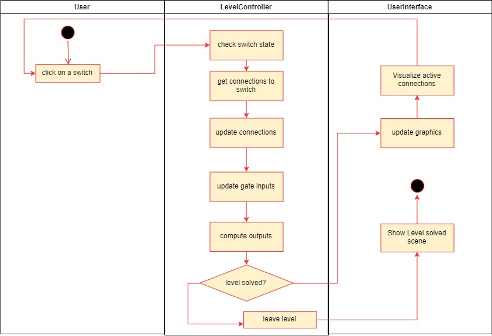

 Artifacts >  Requirements Artifact Set >  Use-Case Model... >  Use Case >  rup_ucspec.htm

<Project LogicGame>

Use Case Specification: <Use-Case play level>

 

Version <1.0>

## Revision History

| Date       | Version | Description                 | Author         |
|------------|---------|-----------------------------|----------------|
| 24.10.2019 | 1.0     | first implementation of UCS | Team LogicGame |
| 24.10.2019 | 1.1     | added mock up               | Team LogicGame |
|            |         |                             |                |
|            |         |                             |                |
 

 

1.                 play level

1.1               Brief Description

User pushes the button to update the inputs of the gates. 

2.                  Flow of Events
2.1               Basic Flow
* the user clicks on the switch
* in consequence all connections outgoing from that switch will be updated and set to the value of the switch
* including the inputs of the connected gates
* each gate will compute the output based on its input signals
* the level controller is going to check whether the level is solved or not
* If it is not solved the user interface is going to draw the connection lines in a different color
* the user will know if the level is solved when the stage cleared sign lights up
* if it is solved the user can click the next level button which will load the next level or leave the level to the main menu

2.1.1 Activity Diagram

2.1.2 Mock Up

2.2               Alternative Flows

n/a

3.                  Special Requirements

n/a
 

4.                  Preconditions

4.1               Level selector
 
A level has to be selected. 
Take a look at the level selector Use Case Specification to get more information. 

5.                  Postconditions

5.1             Save progress
 
If the level has been solved the progress has to be saved. Otherwise the user will have to play the same level again. A new level is only unlocked after the old one has been solved. 

6.                  Extension Points

n/a
 